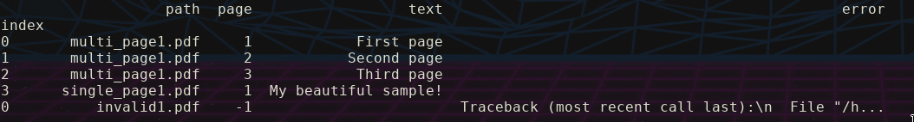

# pdf2dataset


For extracting text from PDFs and save to a dataset

## Install

### Install Dependencies

#### Ubuntu (or debians)

``` bash
$ sudo apt update
$ sudo apt install -y poppler-utils tesseract-ocr-por
```

### Install pdf2dataset

#### For usage

``` bash
# first, clone repository

$ pip3 install pdf2dataset --user # Please, isolate the environment
```


#### For development

``` bash
# first, clone repository

$ poetry install
```

## Usage examples


### Simple

``` bash
# Reads all PDFs from my_pdfs_folder and saves the resultant dataframe to my_df.parquet.gzip
$ pdf2dataset my_pdfs_folder my_df.parquet.gzip
```

### Keeping progress

``` bash
# Keep progress in tmp folder, so can resume processing in case of any error or interruption
# To resume, just use the same --tmp-dir folder
$ pdf2dataset my_pdfs_folder my_df.parquet.gzip --tmp-dir tmp
```

### Help
``` bash
$ pdf2dataset -h
usage: pdf2dataset [-h] [--tmp-dir TMP_DIR] [--lang LANG]
                   [--num-cpus NUM_CPUS] [--address ADDRESS]
                   [--webui-host WEBUI_HOST] [--redis-password REDIS_PASSWORD]
                   input_dir results_file

Extract text from all PDF files in a directory

positional arguments:
  input_dir             The folder to lookup for PDF files recursively
  results_file          File to save the resultant dataframe

optional arguments:
  -h, --help            show this help message and exit
  --tmp-dir TMP_DIR     The folder to keep all the results, including log
                        files and intermediate files
  --lang LANG           Tesseract language
  --num-cpus NUM_CPUS   Number of cpus to use
  --address ADDRESS     Ray address to connect
  --webui-host WEBUI_HOST
                        Which port ray webui to listen
  --redis-password REDIS_PASSWORD
                        Redis password to use to connect with redis
```

### Sample output


